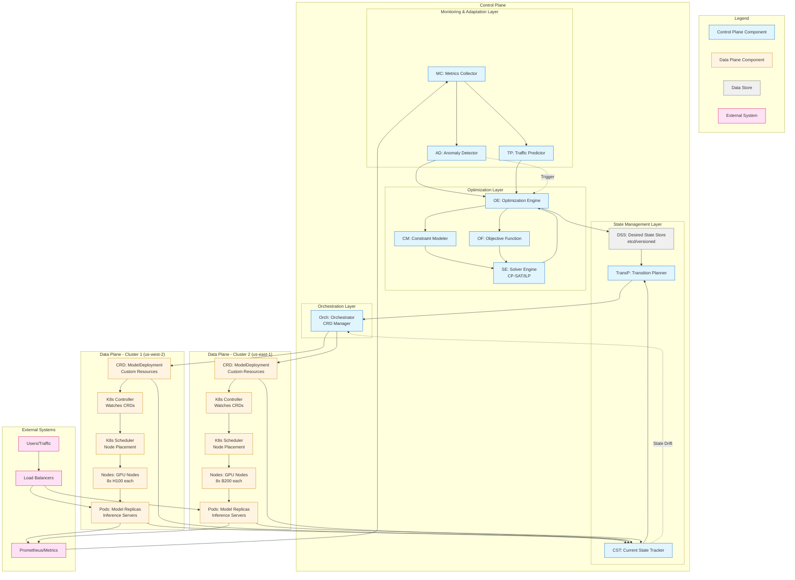

# LLM Multi-Cluster Scheduling System
## Complete Design Document

**Version:** 1.0
**Date:** October 27, 2025
**Status:** Design Review

---

## Executive Summary

This document presents a comprehensive design for an intelligent scheduling and placement system for serving Large Language Models (LLMs) across multiple Kubernetes clusters with heterogeneous GPU resources. The system optimizes for maximal GPU utilization while meeting Service Level Agreements (SLAs) and revenue objectives through a hierarchical, two-level scheduling architecture.

**Key Design Decisions:**
- ✅ Hierarchical scheduling (cluster-level by global optimizer, node-level by K8s)
- ✅ Event-driven + periodic re-optimization
- ✅ Phased transitions with automatic rollback
- ✅ Dedicated endpoints get priority over serverless

---

## Table of Contents

1. [Requirements](#requirements)
2. [System Architecture](#system-architecture)
3. [Component Specifications](#component-specifications)
4. [Scheduler Control Loop](#scheduler-control-loop)
5. [Key Design Decisions](#key-design-decisions)
6. [Data Models](#data-models)
7. [Implementation Phases](#implementation-phases)
8. [Open Questions](#open-questions)

---

## Requirements

### Functional Requirements

**Deployment Configurations:**
- **Single-node deployments:** 1, 2, 4, or 8 GPUs per node
- **Multi-node deployments:** 16 GPUs using LeaderWorkerSet (LWS)
- **Future:** Prefill-decode disaggregated architectures

**Service Tiers:**
- **Dedicated endpoints** (private, customer-specific)
  - Strict SLA guarantees, highest priority
  - Fixed $/hour revenue model
- **Serverless endpoints** (shared, public)
  - Best-effort service, lower priority
  - Token-based revenue model

**Inputs:**
- Available nodes across clusters (location, GPU type, storage)
- Model performance profiles (TPS, TTFT across input/output lengths)
- Revenue models per model
- Target SLAs per model
- Traffic patterns and forecasts

**Optimization Goals:**
- Maximize GPU utilization
- Meet or exceed SLA targets
- Maximize revenue generation
- Enable dynamic traffic response

### Non-Functional Requirements

- **Latency:** Sub-minute placement decision latency (<10 seconds preferred)
- **Transitions:** Safe state migrations (A → B) without SLA violations
- **Adaptation:** Handle traffic fluctuations beyond predictions
- **Observability:** Full system state visibility for debugging

### Cluster Characteristics

| Attribute | Options |
|-----------|---------|
| **GPU Types** | B200, H200, H100, A100, L40 |
| **Storage** | Per-node /scratch disk, Shared storage (WEKA/VAST) |
| **Location** | Multiple regions, geo-distributed |

---

## System Architecture

### High-Level Component Architecture



### Architecture Layers

#### Control Plane (Blue Components)
Strategic decision-making and global coordination:

1. **Monitoring & Adaptation Layer**
   - Collects metrics from all clusters
   - Predicts traffic patterns
   - Detects anomalies and triggers optimization

2. **Optimization Layer**
   - Models constraints and objectives
   - Solves placement problem (cluster-level)
   - Achieves "good enough" optimization at scale

3. **State Management Layer**
   - Maintains desired state (versioned)
   - Tracks current state across clusters
   - Plans safe transitions between states

4. **Orchestration Layer**
   - Translates decisions to K8s CRDs
   - Executes phased rollouts
   - Handles rollback on failures

#### Data Plane (Orange Components)
Tactical execution and workload serving:

- **K8s Clusters:** Multiple regions with heterogeneous GPUs
- **Custom Resources:** ModelDeployment CRDs define desired state
- **K8s Controllers:** Watch CRDs and create pods
- **K8s Schedulers:** Assign pods to specific nodes
- **Model Replicas:** Actual inference servers running on GPU nodes

---

## Component Specifications

### MC: Metrics Collector
**Purpose:** Aggregate performance metrics from all model replicas across clusters.

**Metrics Collected:**
- Per-replica: QPS, TPS, TTFT (P50/P95/P99), error rate, GPU utilization
- Per-model: SLA compliance percentage
- Per-cluster: Available GPU capacity, node health

**Implementation:** Prometheus scraping + aggregation service

---

### AD: Anomaly Detector
**Purpose:** Identify conditions requiring re-optimization.

**Triggers:**
- Traffic deviation >50% from prediction
- SLA violations (P99 TTFT breach)
- Cluster capacity changes
- Manual operator request

**Implementation:** Rule-based thresholds + statistical anomaly detection

---

### TP: Traffic Predictor
**Purpose:** Forecast future traffic to enable proactive scaling.

**Output:** Predictions at T+1hour, T+1day, T+1week

**Algorithms:** Time-series forecasting (ARIMA, Prophet, or ML models)

**Trade-off:** Accuracy vs computation cost. Start simple, iterate.

---

### OE: Optimization Engine
**Purpose:** Compute optimal cluster-level placement for all models.

**Decision Variables:**
```
x[model, cluster, replica_count] → How many replicas of each model in each cluster
```

**Constraints:**
- GPU capacity per cluster
- SLA requirements (minimum throughput, latency)
- Model-GPU compatibility
- Topology requirements (single-node vs multi-node)

**Objective Function:**
```
maximize: α×GPU_utilization + β×revenue + γ×SLA_margin - δ×placement_changes
```

**Solver:** Google OR-Tools CP-SAT (recommended for balance of speed & quality)

**Performance:** 2-10 seconds for 50 models × 20 clusters

---

### SE: Solver Engine
**Options:**

| Solver | Optimality | Speed | Scale Limit | Use Case |
|--------|-----------|-------|-------------|----------|
| **CP-SAT** | Very Good | Fast (seconds) | ~10,000 vars | Recommended default |
| **ILP (Gurobi)** | Optimal | Medium (seconds-minutes) | ~5,000 vars | High-value dedicated |
| **Heuristics** | Approximate | Very Fast (ms) | Unlimited | Serverless fallback |

---

### DSS: Desired State Store
**Purpose:** Persist optimization results as versioned state.

**Schema:**
```json
{
  "version": 42,
  "timestamp": "2025-10-27T12:00:00Z",
  "placements": [
    {
      "model_id": "llama-3-70b",
      "cluster_id": "us-west-2-h100",
      "replica_count": 5,
      "gpus_per_replica": 4
    }
  ]
}
```

**Implementation:** etcd for consistency and watch capability

---

### TransP: Transition Planner
**Purpose:** Generate safe execution plan to move from state A → state B.

**Algorithm:**
```
Phase 1: Scale Up (safe, adds capacity)
  - Create new replicas in target clusters
  - Wait for health checks

Phase 2: Traffic Shift (gradual)
  - 0% → 30% → 60% → 100% over several minutes
  - Monitor error rates at each step
  - Automatic rollback if errors spike

Phase 3: Scale Down (cleanup)
  - Drain connections from old replicas
  - Gracefully shutdown pods
  - Free GPU resources
```

**Safety:** Maintains minimum replicas at all times, never disrupts traffic

---

### Orch: Orchestrator
**Purpose:** Execute transition plans by managing K8s CRDs across clusters.

**Interface:** K8s API for CRD creation/updates

**Responsibilities:**
- Create/update ModelDeployment CRDs
- Monitor pod health during rollout
- Execute traffic shifting
- Trigger rollback on failures

---

## Scheduler Control Loop

### Complete Execution Flow

```mermaid
sequenceDiagram
    participant MC as MC: Metrics Collector
    participant AD as AD: Anomaly Detector
    participant TP as TP: Traffic Predictor
    participant OE as OE: Optimization Engine
    participant SE as SE: Solver Engine
    participant DSS as DSS: Desired State Store
    participant CST as CST: Current State Tracker
    participant TransP as TransP: Transition Planner
    participant Orch as Orch: Orchestrator
    participant CRD as CRD: ModelDeployment CRDs
    participant K8sCtrl as K8s Controller
    participant K8sSched as K8s Scheduler
    participant Pods as Pods: Model Replicas

    Note over MC,Pods: ═══ LEGEND ═══<br/>See Architecture Diagram for Component Details<br/>MC=Metrics Collector | AD=Anomaly Detector | TP=Traffic Predictor<br/>OE=Optimization Engine | SE=Solver | DSS=State Store | CST=State Tracker<br/>TransP=Transition Planner | Orch=Orchestrator | CRD=Custom Resources

    Note over MC,Pods: ═══ Phase 1: CONTINUOUS MONITORING ═══

    loop Every 30 seconds
        Pods->>MC: Push metrics (QPS, TPS, TTFT, GPU util)
        MC->>MC: Aggregate metrics by model/cluster
        MC->>AD: Stream metrics
    end

    loop Every 5 minutes
        MC->>TP: Historical traffic data
        TP->>TP: Generate traffic forecast (T+1h, T+1d)
        TP->>TP: Store predictions
    end

    Note over MC,Pods: ═══ Phase 2: EVENT DETECTION & TRIGGER ═══

    alt Traffic Anomaly Detected
        AD->>AD: Detect: Traffic spike > 50% of prediction
        AD->>OE: TRIGGER: Re-optimization needed
        Note right of AD: Event: Traffic for llama-70b<br/>jumped from 1000 to 1800 QPS
    else SLA Violation
        AD->>AD: Detect: P99 TTFT > SLA threshold
        AD->>OE: TRIGGER: Urgent re-optimization (priority=HIGH)
        Note right of AD: Event: Model A breaching SLA<br/>P99 TTFT: 250ms (SLA: 200ms)
    else Scheduled Optimization
        Note over OE: Timer: Every 15 minutes
        OE->>OE: TRIGGER: Periodic optimization
    else Manual Trigger
        Note over OE: Operator API call
        OE->>OE: TRIGGER: Manual optimization
    end

    Note over MC,Pods: ═══ Phase 3: OPTIMIZATION ═══

    OE->>CST: Request: Get current cluster state
    activate CST
    CST->>CRD: Query: All ModelDeployment status
    CRD-->>CST: Response: Current deployments
    CST->>Pods: Query: Running replica status
    Pods-->>CST: Response: Health, utilization, QPS
    CST-->>OE: Response: Current state snapshot<br/>{clusters, nodes, replicas, utilization}
    deactivate CST

    OE->>TP: Request: Get traffic predictions
    TP-->>OE: Response: Forecasted load per model<br/>{model_id, predicted_qps, predicted_tokens}

    OE->>DSS: Request: Get last desired state (version N)
    DSS-->>OE: Response: Previous placement decisions

    OE->>OE: Build optimization problem
    Note right of OE: Variables: x[model,cluster,replicas]<br/>Constraints: capacity, SLA, topology<br/>Objective: α×GPU_util + β×revenue - δ×changes

    OE->>SE: Request: Solve optimization problem
    activate SE
    SE->>SE: Run CP-SAT solver
    Note right of SE: Processing 1,250 variables<br/>3,400 constraints
    SE->>SE: Solve time: 2.3 seconds
    SE-->>OE: Response: Solution found (objective=0.87)
    deactivate SE

    alt Solution Found
        OE->>OE: Validate solution feasibility
        OE->>DSS: Save new desired state (version N+1)
        activate DSS
        Note right of DSS: Version N+1:<br/>llama-70b: us-west-2 (3→5 replicas)<br/>gpt-4: us-east-1 (4→3 replicas)
        DSS-->>OE: Response: State saved
        deactivate DSS

        Note over MC,Pods: ═══ Phase 4: TRANSITION PLANNING ═══

        OE->>TransP: Request: Compute transition plan
        activate TransP
        TransP->>DSS: Get desired state (version N+1)
        DSS-->>TransP: Response: Target state
        TransP->>CST: Get current state (version N)
        CST-->>TransP: Response: Current state

        TransP->>TransP: Compute diff (current vs desired)
        Note right of TransP: Changes identified:<br/>+2 replicas: llama-70b @ us-west-2<br/>-1 replica: gpt-4 @ us-east-1

        TransP->>TransP: Generate phased execution plan
        Note right of TransP: Phase 1: Scale up (parallel)<br/>Phase 2: Traffic shift (gradual)<br/>Phase 3: Scale down (cleanup)

        TransP-->>Orch: Response: Transition plan with phases
        deactivate TransP

        Note over MC,Pods: ═══ Phase 5: ORCHESTRATION - Scale Up ═══

        Orch->>Orch: Execute Phase 1 (Scale Up)

        loop For each scale-up change
            Orch->>CRD: Update ModelDeployment CRD
            Note right of Orch: Update llama-70b deployment<br/>spec.replicas: 3 → 5
            activate CRD
            CRD->>K8sCtrl: Event: CRD updated
            deactivate CRD

            activate K8sCtrl
            K8sCtrl->>K8sCtrl: Reconcile: Create 2 new pods
            K8sCtrl->>K8sSched: Request: Schedule 2 new pods
            deactivate K8sCtrl

            activate K8sSched
            K8sSched->>K8sSched: Find suitable nodes<br/>(nodeSelector: gpu-type=H100, storage=shared)
            K8sSched->>K8sSched: Bin packing algorithm
            K8sSched->>Pods: Assign: Pod-4 → node-23, Pod-5 → node-31
            deactivate K8sSched

            activate Pods
            Pods->>Pods: Pull model weights from storage
            Pods->>Pods: Initialize inference server
            Pods->>Pods: Load model into GPU memory
            Pods->>Pods: Run health checks
            deactivate Pods

            loop Health Check (every 10s, max 5 min)
                Orch->>Pods: Check pod readiness
                alt Pod Ready
                    Pods-->>Orch: Status: Ready=True, accepting traffic
                    Note right of Pods: Health check passed:<br/>- HTTP /health: 200 OK<br/>- GPU loaded: ✓<br/>- Test inference: ✓
                else Pod Not Ready
                    Pods-->>Orch: Status: Ready=False, initializing
                    Note right of Orch: Retry in 10 seconds<br/>(attempt 3/30)
                end
            end
        end

        Orch->>Orch: Wait for all Phase 1 changes complete
        Note right of Orch: All 2 new replicas healthy ✓

        Note over MC,Pods: ═══ Phase 5: ORCHESTRATION - Traffic Shift ═══

        Orch->>Orch: Execute Phase 2 (Traffic Shift)

        loop For each traffic shift (gradual migration)
            Orch->>CRD: Update service endpoint weights
            Note right of Orch: Shift traffic gradually:<br/>Step 1: Old 100% → 70%, New 0% → 30%<br/>Step 2: Old 70% → 40%, New 30% → 60%<br/>Step 3: Old 40% → 0%, New 60% → 100%

            Orch->>Orch: Wait 2 minutes (observation period)

            Orch->>MC: Request: Error rate for last 2 min
            activate MC
            MC->>Pods: Query: Error metrics
            Pods-->>MC: Response: Error rate data
            MC->>MC: Calculate: error_rate, p99_latency

            alt Error Rate Normal
                MC-->>Orch: Response: Error rate 0.3% (OK), P99 180ms (OK)
                Note right of Orch: Continue to next step
            else Error Rate Spike
                MC-->>Orch: Response: Error rate 6.2% (ALERT), P99 450ms (BAD)
                deactivate MC
                Note right of Orch: ⚠ ROLLBACK TRIGGERED

                Orch->>Orch: Execute rollback procedure
                Orch->>CRD: Revert traffic weights to previous
                Note right of Orch: Restore: Old 100%, New 0%

                Orch->>DSS: Mark transition as failed
                Orch->>AD: Alert: Traffic shift failed for llama-70b
                Note right of AD: Alert sent to ops team<br/>Reason: High error rate during migration

                Orch->>Orch: ABORT Phase 2, skip to cleanup
            end
        end

        Note over MC,Pods: ═══ Phase 5: ORCHESTRATION - Scale Down ═══

        Orch->>Orch: Execute Phase 3 (Scale Down)

        loop For each scale-down change
            Orch->>CRD: Update traffic weight to 0% for old replicas
            Note right of Orch: Drain: gpt-4 replica @ us-east-1<br/>Gradually reduce to 0% traffic

            Orch->>Orch: Wait for active connections to drain (30s)

            Orch->>CRD: Update ModelDeployment (reduce replicas)
            Note right of Orch: Update gpt-4 deployment<br/>spec.replicas: 4 → 3

            CRD->>K8sCtrl: Event: CRD updated (scale down)
            K8sCtrl->>Pods: Graceful shutdown: Send SIGTERM

            activate Pods
            Pods->>Pods: Complete in-flight requests
            Pods->>Pods: Unload model from GPU
            Pods->>Pods: Shutdown: Exit code 0
            deactivate Pods

            Note right of Pods: GPU resources freed<br/>Node-15: 4 GPUs available
        end

        Orch->>CST: Notify: Transition complete
        activate CST
        CST->>CST: Update internal state cache
        CST-->>Orch: Ack: State updated
        deactivate CST

    else No Feasible Solution
        SE-->>OE: Response: No feasible solution found
        Note right of SE: Constraints cannot be satisfied<br/>Reason: Insufficient H100 capacity

        OE->>AD: ALERT: Cannot meet constraints
        Note right of OE: Alert: Optimization failed<br/>- Required: 40 H100 GPUs<br/>- Available: 32 H100 GPUs<br/>Action: Maintain current state

        OE->>OE: Fallback: Keep current state (version N)
    end

    Note over MC,Pods: ═══ Phase 6: CONTINUOUS STATE RECONCILIATION ═══

    loop Every 60 seconds
        CST->>CRD: Sync: Query all ModelDeployment status
        CRD-->>CST: Response: Current CRD state

        CST->>Pods: Sync: Query actual running replicas
        Pods-->>CST: Response: Pod health, count

        CST->>DSS: Request: Get desired state (latest version)
        DSS-->>CST: Response: Desired state

        CST->>CST: Compare: Current vs Desired

        alt State Drift Detected
            CST->>CST: Detect drift
            Note right of CST: Drift found:<br/>Desired: 5 replicas<br/>Actual: 4 replicas (1 crashed)

            CST->>Orch: Trigger: Reconcile state
            Orch->>CRD: Re-apply desired state
            Note right of Orch: Self-healing: Create missing replica

        else States Match
            CST->>CST: Validation: System converged ✓
            Note right of CST: Current state matches desired state<br/>All models serving correctly
        end
    end

    Note over MC,Pods: ═══ Loop continues indefinitely... ═══
```



### Loop Phases Summary

| Phase | Frequency | Duration | Purpose |
|-------|-----------|----------|---------|
| **1. Monitoring** | 30s | Continuous | Collect metrics, predict traffic |
| **2. Trigger Detection** | Real-time | <1s | Identify need for re-optimization |
| **3. Optimization** | Event-driven | 2-10s | Compute new placement |
| **4. Planning** | After optimization | 1-5s | Generate transition plan |
| **5. Orchestration** | After planning | 5-30min | Execute changes safely |
| **6. Reconciliation** | 60s | Continuous | Self-heal drift |

---

## Key Design Decisions

### 1. Hierarchical Scheduling (Cluster-Level vs Node-Level)

**Decision:** Global scheduler decides **cluster + replica count**, K8s decides **specific nodes**.

**Rationale:**
- **Scalability:** O(models × clusters) vs O(models × nodes) = 1,000 vars vs 50,000 vars
- **Speed:** Seconds vs minutes for optimization
- **Resilience:** K8s handles node failures automatically without global recomputation
- **Operational Simplicity:** Leverage existing K8s scheduling capabilities

**Trade-off:** Lose fine-grained control over node placement, but gain operational benefits.

**For special cases:** Use placement groups and custom schedulers for multi-node LWS deployments.

---

### 2. Solver Selection

**Decision:** Google OR-Tools CP-SAT for primary optimization.

**Why CP-SAT:**
- Handles complex constraints (topology, SLA)
- Fast solve times (2-10 seconds for typical scale)
- Good balance of optimality vs speed
- Open-source (no licensing costs)

**Fallback:** Heuristics for serverless when speed > optimality.

---

### 3. Optimization Frequency

**Decision:** Hybrid approach - Periodic (every 15 min) + Event-driven.

**Events that trigger re-optimization:**
- Traffic anomaly (>50% deviation)
- SLA violation
- Cluster capacity change
- Manual trigger

**Why not continuous?**
- Solver latency (2-10s) + orchestration time (5-30min)
- Thrashing risk from frequent changes
- Most workloads don't need sub-minute reaction

---

### 4. Transition Safety

**Decision:** 3-phase rollout with gradual traffic shift and automatic rollback.

**Safety mechanisms:**
1. Health checks before traffic shift
2. Gradual migration (0% → 30% → 60% → 100%)
3. Error rate monitoring at each step
4. Automatic rollback if error rate spikes
5. Minimum replica count maintained

**Trade-off:** Slower transitions (5-30 min) vs zero-downtime guarantee.

---

### 5. Storage Strategy

**Decision:** Hybrid approach based on availability.

| Cluster Has Shared Storage? | Strategy |
|------------------------------|----------|
| **Yes** | Mount WEKA/VAST, serve directly |
| **No** | Pre-load weights to local /scratch disk |

**Model weight distribution:**
- Use container registry as universal fallback
- Pre-warm likely nodes based on predictions
- Lazy load on first schedule to new node

---

## Data Models

### ModelDeployment CRD

```yaml
apiVersion: inference.company.com/v1
kind: ModelDeployment
metadata:
  name: llama-3-70b-dedicated
  namespace: ml-serving
spec:
  modelId: llama-3-70b
  replicas: 5
  gpusPerReplica: 4
  topology: single-node  # or multi-node for LWS

  # Hints for K8s scheduler
  nodeSelector:
    gpu-type: H100
    storage-type: shared

  priorityClassName: dedicated-high

  topologySpreadConstraints:
  - maxSkew: 1
    topologyKey: kubernetes.io/hostname
    whenUnsatisfiable: DoNotSchedule

  resources:
    limits:
      nvidia.com/gpu: 4

  modelConfig:
    maxBatchSize: 32
    tensorParallelism: 4
    weightsPath: /shared-storage/models/llama-3-70b

status:
  availableReplicas: 5
  observedGeneration: 42
  conditions:
  - type: Ready
    status: "True"
```

### Optimization State

```json
{
  "version": 42,
  "timestamp": "2025-10-27T12:34:56Z",
  "solve_time_ms": 2341,
  "objective_value": 0.87,
  "placements": [
    {
      "model_id": "llama-3-70b",
      "deployment_type": "dedicated",
      "cluster_id": "us-west-2-h100",
      "replica_count": 5,
      "gpus_per_replica": 4,
      "topology": "single-node",
      "expected_qps": 1500,
      "expected_revenue_per_hour": 250.0
    },
    {
      "model_id": "gpt-4-turbo",
      "deployment_type": "serverless",
      "cluster_id": "us-east-1-h100",
      "replica_count": 3,
      "gpus_per_replica": 8,
      "topology": "single-node",
      "expected_qps": 800,
      "expected_revenue_per_hour": 180.0
    }
  ],
  "total_gpu_utilization": 0.83,
  "total_expected_revenue": 430.0
}
```

---

## Implementation Phases

### Phase 1: MVP (Months 1-2)
**Goal:** Basic scheduling with manual intervention.

**Deliverables:**
- ✅ Optimization engine with CP-SAT solver
- ✅ Single optimization run (no re-optimization)
- ✅ Support single-node deployments only
- ✅ Manual CRD creation for deployment
- ✅ Basic metrics collection (Prometheus)

**Success Criteria:** Can compute valid placements for 10 models across 5 clusters in <30s.

---

### Phase 2: Automation (Months 3-4)
**Goal:** Closed-loop automation with safe transitions.

**Deliverables:**
- ✅ Automated re-optimization (periodic + event-driven)
- ✅ Transition planner with 3-phase rollout
- ✅ Orchestrator with automatic CRD management
- ✅ Multi-node (LWS) support
- ✅ Health checks and rollback logic

**Success Criteria:** Handle traffic spikes without manual intervention, zero SLA violations during transitions.

---

### Phase 3: Intelligence (Months 5-6)
**Goal:** Predictive optimization and advanced features.

**Deliverables:**
- ✅ Traffic predictor (ML-based forecasting)
- ✅ Anomaly detector with smart triggers
- ✅ Dedicated vs serverless prioritization
- ✅ Cost optimization (minimize $/GPU)
- ✅ Advanced solver techniques for scale

**Success Criteria:** 90% of traffic changes handled proactively, GPU utilization >80%.

---

### Phase 4: Scale & Resilience (Months 7+)
**Goal:** Production-grade reliability and scale.

**Deliverables:**
- ✅ Support >50 clusters, >100 models
- ✅ HA for control plane (active-standby)
- ✅ Disaster recovery and state backup
- ✅ Prefill-decode disaggregation support
- ✅ Advanced observability (dashboards, debugging tools)

**Success Criteria:** 99.9% control plane uptime, handle 10x traffic spikes gracefully.

---

## Open Questions

### High Priority

1. **Latency Requirements**
   - What is acceptable user-facing latency? <100ms? <500ms?
   - Affects cluster selection and geo-distribution strategy.

2. **Cost Model**
   - Relative cost of B200 vs H100 vs A100?
   - Power/cooling constraints per datacenter?
   - Network egress costs between regions?

3. **Acceptable Solve Time**
   - Is <10 seconds required for optimization?
   - Or can we tolerate 30-60 seconds?
   - Determines whether we need heuristics vs exact methods.

4. **Transition Time Budget**
   - How fast must we adapt? Minutes? Hours?
   - Affects aggressiveness of rollout strategy.

### Medium Priority

5. **Traffic Patterns**
   - What is typical variance? 2x? 10x?
   - Predictable daily/weekly patterns?
   - Frequency of flash crowd events?

6. **Failure Rates**
   - Expected node/GPU failure rate?
   - Need for active-active HA for dedicated endpoints?

7. **Model Update Cadence**
   - How often are new models deployed?
   - Can we do in-place updates?

### Low Priority (Can defer)

8. **Prefill-Decode Details**
   - Network bandwidth requirements?
   - Scheduling constraints between phases?

9. **Multi-Tenancy**
   - Need for hard isolation between customers?
   - Security/compliance requirements?

---

## Success Metrics

| Metric | Target | Measurement |
|--------|--------|-------------|
| **GPU Utilization** | >80% cluster-wide | Average GPU usage across all clusters |
| **SLA Compliance** | >99.9% (dedicated)<br/>99% (serverless) | % of requests meeting latency SLA |
| **Revenue per GPU** | Maximize $/GPU-hour | Total revenue / GPU-hours consumed |
| **Optimization Latency** | <10 seconds | Time to compute new placement |
| **Transition Time** | <10 minutes | Time to converge to new state |
| **Solver Success Rate** | >95% | % of optimizations finding feasible solution |
| **Control Plane Uptime** | >99.9% | Availability of scheduler service |

---

## Risks & Mitigations

| Risk | Likelihood | Impact | Mitigation |
|------|-----------|--------|-----------|
| Solver doesn't scale | Medium | High | Tiered solving: CP-SAT for critical, heuristics for serverless |
| Frequent changes cause thrashing | Medium | Medium | Minimum change thresholds, damping factor in objective |
| State transitions violate SLAs | Low | High | Gradual traffic shifts, health checks, automatic rollback |
| Infeasible constraints | Medium | High | Constraint validation in tests, graceful degradation |
| Traffic prediction inaccuracy | High | Low | Safety buffers, reactive fallback |
| Control plane failure | Low | High | Active-standby HA with etcd leader election |

---

## Appendix: Why Hierarchical Scheduling?

### The Debate: Centralized Node-Level vs Hierarchical

**Centralized Argument:** "Only a global view can achieve true optimality."

**Reality:** Perfect optimization is theoretically optimal but practically impossible at scale.

#### Why Hierarchical Wins:

1. **NP-Hard Problem:** Finding optimal placement is computationally intractable. At scale, you're using heuristics either way.

2. **State Consistency:** By the time a centralized scheduler makes a decision based on global state, that state has changed. Your "optimal" placement is based on stale data.

3. **Failure Recovery:**
   - Centralized: Node fails → Global recomputation → Minutes
   - Hierarchical: Node fails → K8s reschedules locally → Seconds

4. **Real-World Evidence:**
   - Google evolved from Borg (centralized) to Kubernetes (hierarchical)
   - Microsoft's Autopilot: "Centralized scheduling does not scale"
   - Mesos explicitly two-level by design

#### Best of Both Worlds

The global scheduler provides **strategic constraints** to K8s:
- GPU type requirements
- Storage requirements
- Topology spread
- Priority classes
- Placement groups for special cases

K8s handles **tactical placement** with real-time state.

This achieves "good enough" optimization with excellent operational properties.

---

## References

- Google Borg Paper: "Large-scale cluster management at Google with Borg"
- Google Omega Paper: "Omega: flexible, scalable schedulers for large compute clusters"
- Mesos Paper: "Mesos: A Platform for Fine-Grained Resource Sharing in the Data Center"
- Kubernetes Scheduling Framework
- Google OR-Tools CP-SAT Documentation

---

**Document Version:** 1.0
**Last Updated:** October 27, 2025
**Status:** Ready for Review
