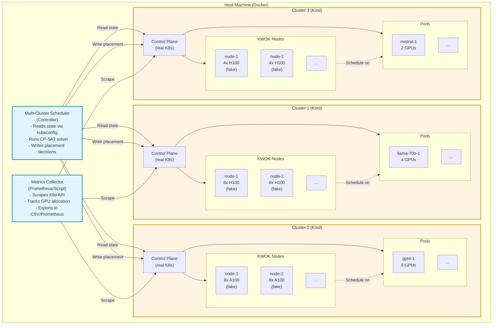

# Schedulator: Multi-Cluster GPU Scheduling Simulator
## Design Requirements Document

**Version:** 2.0  
**Date:** October 27, 2025  
**Status:** Requirements Definition

---

## Executive Summary

**Schedulator** is a focused simulation environment to test multi-cluster LLM scheduling algorithms with emphasis on **scheduling decisions, GPU utilization, and resource fragmentation**. It leverages existing Kubernetes tooling (Kind/k3s or kube-scheduler-simulator) instead of building from scratch.

**Core Focus:**
- ✅ Test scheduling algorithms across 3-10 clusters
- ✅ Measure GPU utilization and fragmentation
- ✅ Validate placement decisions under various workload patterns
- ✅ Benchmark solver performance (solve times, decision quality)
- ✅ Test failure recovery and rebalancing

**Out of Scope:**
- ❌ No actual inference simulation (no LLM serving)
- ❌ No traffic replay or request processing
- ❌ No latency modeling (TTFT, TPS)
- ❌ Just focus on resource allocation, not serving behavior

---

## Table of Contents

1. [Requirements](#requirements)
2. [Architecture Decision](#architecture-decision)
3. [Component Design](#component-design)
4. [Workload Patterns](#workload-patterns)
5. [Metrics & Analysis](#metrics--analysis)
6. [Implementation Plan](#implementation-plan)

---

## Requirements

### Functional Requirements

#### FR-1: Multi-Cluster Environment
- **FR-1.1** Support 3-10 Kubernetes clusters running locally
- **FR-1.2** Each cluster configurable with:
  - Node count (5-20 nodes per cluster)
  - GPU types per node (H100, A100, L40, mixed)
  - GPU count per node (2, 4, 8 GPUs)
  - Node labels (region, storage-type, gpu-type)
- **FR-1.3** Simulate heterogeneous cluster configurations
- **FR-1.4** Use real K8s API (not mocked) for authenticity

#### FR-2: GPU Resource Simulation
- **FR-2.1** Represent GPUs using K8s Extended Resources (`nvidia.com/gpu`)
- **FR-2.2** Track GPU allocation at pod level
- **FR-2.3** Measure fragmentation:
  - Total available GPUs
  - Largest contiguous GPU block per node
  - Number of stranded GPUs (unusable due to fragmentation)
- **FR-2.4** Support GPU topology constraints:
  - Single-node: 1, 2, 4, 8 GPUs
  - Multi-node: 16 GPUs using LeaderWorkerSet

#### FR-3: Model Deployment Workloads
- **FR-3.1** Define model workloads as K8s Deployments/StatefulSets
- **FR-3.2** Each model specifies:
  - GPU requirements (1, 2, 4, 8, or 16 GPUs)
  - Topology (single-node vs multi-node)
  - Replica count (desired instances)
  - Priority (dedicated vs serverless)
  - Node affinity/anti-affinity rules
- **FR-3.3** No actual containers needed (use pause containers or KWOK)

#### FR-4: Workload Patterns
- **FR-4.1** Static workload: Fixed set of models with constant replicas
- **FR-4.2** Dynamic scaling: Replica counts change over time
- **FR-4.3** Batch submission: Models arrive at different times
- **FR-4.4** Load from YAML scenarios (declarative)

#### FR-5: Scheduler Integration
- **FR-5.1** Deploy custom multi-cluster scheduler as K8s controller
- **FR-5.2** Scheduler reads cluster state via K8s API
- **FR-5.3** Scheduler writes placement decisions as:
  - Updates to Deployment specs
  - Or writes to ModelDeployment CRDs per cluster
- **FR-5.4** Measure scheduler decision latency (time to compute placement)

#### FR-6: Failure Injection
- **FR-6.1** Cordon nodes (simulate node failure)
- **FR-6.2** Drain nodes (simulate maintenance)
- **FR-6.3** Delete pods (simulate crashes)
- **FR-6.4** Add/remove clusters dynamically

### Non-Functional Requirements

#### NFR-1: Simplicity
- **NFR-1.1** Leverage existing tools (Kind/k3s, kube-scheduler-simulator, KWOK)
- **NFR-1.2** Minimal custom code (configuration over implementation)
- **NFR-1.3** Standard K8s tooling (kubectl, kubeconfig)

#### NFR-2: Performance
- **NFR-2.1** Run 3-10 clusters on laptop (16GB RAM minimum)
- **NFR-2.2** Startup time <2 minutes
- **NFR-2.3** Support 100-500 model replicas total

#### NFR-3: Observability
- **NFR-3.1** Export metrics to Prometheus or CSV
- **NFR-3.2** Query cluster state via kubectl
- **NFR-3.3** Visualize GPU utilization over time
- **NFR-3.4** Log scheduler decisions and reasons

---

## Architecture Decision

### Chosen Approach: **Kind + KWOK Hybrid**

**Architecture:**
- Use **Kind** (Kubernetes in Docker) to create multiple lightweight clusters
- Use **KWOK** (Kubernetes Without Kubelet) to simulate nodes without real containers
- Custom **Multi-Cluster Scheduler** runs as external controller
- Standard K8s resources (no custom simulation framework)

**Why this approach:**

| Aspect | Decision | Rationale |
|--------|----------|-----------|
| **Cluster Runtime** | Kind | Lightweight, real K8s, mature |
| **Node Simulation** | KWOK | No kubelet overhead, fast startup, fake resources |
| **GPU Representation** | K8s Extended Resources | Standard approach, works with scheduling |
| **Scheduler Integration** | K8s Controller | Real K8s API, authentic behavior |
| **Workloads** | Pause containers or KWOK pods | No actual model loading |

**Advantages:**
- ✅ Real K8s behavior (scheduling, CRDs, controllers)
- ✅ Use kubectl, kubeconfig, standard tooling
- ✅ Scheduler code is production-like (uses client-go)
- ✅ Easy to inspect state (`kubectl get pods -A`)
- ✅ Can test actual CRD controllers

**Trade-offs:**
- Limited to ~10 clusters on laptop (resource constraints)
- Can't easily accelerate time (K8s runs at wall-clock)
- Slower than pure simulation (~2min startup vs <10s)

**For this use case:** Trade-offs are acceptable because focus is on scheduling correctness, not speed.

---

## Component Design

### Architecture Diagram



### Component 1: Cluster Setup Script

**Purpose:** Bootstrap multiple Kind clusters with KWOK nodes.

**Responsibilities:**
- Create N Kind clusters with unique kubeconfig contexts
- Install KWOK in each cluster
- Create fake nodes with GPU resources
- Apply node labels (gpu-type, region, storage-type)

**Implementation:**
```bash
#!/bin/bash
# setup-clusters.sh

NUM_CLUSTERS=3

for i in $(seq 1 $NUM_CLUSTERS); do
  echo "Creating cluster-$i..."
  
  kind create cluster --name cluster-$i
  
  # Install KWOK
  kubectl --context kind-cluster-$i apply -f \
    https://github.com/kubernetes-sigs/kwok/releases/download/v0.4.0/kwok.yaml
  
  # Create fake nodes
  kubectl --context kind-cluster-$i apply -f \
    config/cluster-$i-nodes.yaml
done

# Merge kubeconfigs
kubectl config view --flatten > ~/.kube/schedulator-config
```

**Node Definition (KWOK):**
```yaml
# cluster-1-nodes.yaml
apiVersion: v1
kind: Node
metadata:
  annotations:
    kwok.x-k8s.io/node: fake
  labels:
    gpu-type: H100
    region: us-west-2
    storage-type: shared
    topology.kubernetes.io/zone: us-west-2a
  name: node-1
spec:
  taints: []
status:
  allocatable:
    nvidia.com/gpu: "8"
    memory: 512Gi
    cpu: "96"
  capacity:
    nvidia.com/gpu: "8"
    memory: 512Gi
    cpu: "96"
  conditions:
  - status: "True"
    type: Ready
---
apiVersion: v1
kind: Node
metadata:
  annotations:
    kwok.x-k8s.io/node: fake
  labels:
    gpu-type: H100
    region: us-west-2
    storage-type: shared
  name: node-2
spec:
  taints: []
status:
  allocatable:
    nvidia.com/gpu: "8"
    memory: 512Gi
    cpu: "96"
  capacity:
    nvidia.com/gpu: "8"
    memory: 512Gi
    cpu: "96"
  conditions:
  - status: "True"
    type: Ready
```

### Component 2: Model Deployment Definitions

**Purpose:** Define LLM workloads as K8s resources.

**Example:**
```yaml
# workloads/llama-70b.yaml
apiVersion: apps/v1
kind: Deployment
metadata:
  name: llama-70b
  namespace: models
  labels:
    model: llama-70b
    tier: dedicated
spec:
  replicas: 0  # Initially 0, scheduler will set this
  selector:
    matchLabels:
      model: llama-70b
  template:
    metadata:
      labels:
        model: llama-70b
        tier: dedicated
    spec:
      nodeSelector:
        gpu-type: H100  # Prefer H100
      affinity:
        podAntiAffinity:
          requiredDuringSchedulingIgnoredDuringExecution:
          - labelSelector:
              matchLabels:
                model: llama-70b
            topologyKey: kubernetes.io/hostname  # Spread across nodes
      containers:
      - name: model
        image: registry.k8s.io/pause:3.9  # Dummy container
        resources:
          requests:
            nvidia.com/gpu: "4"
            memory: 80Gi
            cpu: "16"
          limits:
            nvidia.com/gpu: "4"
            memory: 80Gi
            cpu: "16"
---
apiVersion: apps/v1
kind: Deployment
metadata:
  name: gpt-4-turbo
  namespace: models
  labels:
    model: gpt-4-turbo
    tier: serverless
spec:
  replicas: 0
  selector:
    matchLabels:
      model: gpt-4-turbo
  template:
    metadata:
      labels:
        model: gpt-4-turbo
        tier: serverless
    spec:
      nodeSelector:
        gpu-type: A100  # Can use A100
      containers:
      - name: model
        image: registry.k8s.io/pause:3.9
        resources:
          requests:
            nvidia.com/gpu: "8"
            memory: 160Gi
            cpu: "32"
          limits:
            nvidia.com/gpu: "8"
            memory: 160Gi
            cpu: "32"
```

### Component 3: Multi-Cluster Scheduler

**Purpose:** Central controller that makes placement decisions.

**Architecture:**
```
Multi-Cluster Scheduler
│
├─ Cluster State Collector
│  └─ Query all clusters via K8s API
│     - List nodes, available GPUs
│     - List pods, allocated GPUs
│     - Compute fragmentation metrics
│
├─ Optimization Engine
│  └─ Input: Cluster state + model requirements
│     └─ Solver: CP-SAT or ILP
│        └─ Output: Placement decisions
│
└─ Placement Executor
   └─ Apply decisions to clusters
      - Update Deployment.spec.replicas
      - Set nodeSelector/affinity
      - Trigger pod creation
```

**High-Level API:**
```python
class MultiClusterScheduler:
    def __init__(self, kubeconfig_path: str):
        """Initialize with kubeconfig for all clusters"""
        self.clusters = load_clusters(kubeconfig_path)
        self.solver = CPSATSolver()
    
    def collect_state(self) -> ClusterState:
        """Query all clusters and aggregate state"""
        state = ClusterState()
        for cluster in self.clusters:
            nodes = cluster.list_nodes()
            pods = cluster.list_pods(namespace="models")
            state.add_cluster(cluster.id, nodes, pods)
        return state
    
    def optimize(self, state: ClusterState, models: List[ModelSpec]) -> Placement:
        """Compute optimal placement"""
        problem = build_optimization_problem(state, models)
        solution = self.solver.solve(problem)
        return solution
    
    def apply_placement(self, placement: Placement):
        """Execute placement decisions"""
        for decision in placement.decisions:
            cluster = self.clusters[decision.cluster_id]
            cluster.scale_deployment(
                name=decision.model_id,
                replicas=decision.replica_count,
                node_selector=decision.node_selector
            )
    
    def run_loop(self, interval: int = 900):
        """Main control loop"""
        while True:
            state = self.collect_state()
            placement = self.optimize(state, self.models)
            self.apply_placement(placement)
            
            # Log metrics
            self.log_metrics(state, placement)
            
            time.sleep(interval)
```

### Component 4: Metrics Collector

**Purpose:** Track GPU utilization and fragmentation over time.

**Metrics to Collect:**

```python
@dataclass
class GPUMetrics:
    timestamp: float
    cluster_id: str
    
    # Utilization
    total_gpus: int
    allocated_gpus: int
    free_gpus: int
    utilization_pct: float  # allocated / total
    
    # Fragmentation
    largest_contiguous_block: int  # Largest # of GPUs on single node
    stranded_gpus: int  # GPUs that can't be used due to fragmentation
    fragmentation_score: float  # 0 = no fragmentation, 1 = worst
    
    # Per GPU type
    gpu_type_utilization: Dict[str, float]  # {H100: 0.85, A100: 0.72}
    
    # Per model
    model_replicas: Dict[str, int]  # {llama-70b: 5, gpt4: 3}

def compute_fragmentation(nodes: List[Node]) -> float:
    """
    Fragmentation score based on wasted capacity.
    
    Example: 
    - Node A: 8 GPUs, 3 allocated, 5 free (can fit 4-GPU model)
    - Node B: 8 GPUs, 7 allocated, 1 free (stranded, can't fit anything)
    - Fragmentation = stranded_gpus / total_free_gpus = 1/6 = 0.17
    """
    total_free = sum(node.free_gpus for node in nodes)
    stranded = sum(
        node.free_gpus 
        for node in nodes 
        if node.free_gpus < MIN_USEFUL_GPUS
    )
    return stranded / total_free if total_free > 0 else 0.0
```

**Collection Script:**
```python
import time
from kubernetes import client, config

def collect_metrics(clusters: List[str]) -> List[GPUMetrics]:
    metrics = []
    
    for cluster_name in clusters:
        config.load_kube_config(context=f"kind-{cluster_name}")
        v1 = client.CoreV1Api()
        
        nodes = v1.list_node()
        pods = v1.list_pod_for_all_namespaces()
        
        total_gpus = 0
        allocated_gpus = 0
        
        for node in nodes.items:
            capacity = node.status.allocatable.get("nvidia.com/gpu", "0")
            total_gpus += int(capacity)
        
        for pod in pods.items:
            if pod.status.phase == "Running":
                for container in pod.spec.containers:
                    requests = container.resources.requests or {}
                    gpu_request = requests.get("nvidia.com/gpu", "0")
                    allocated_gpus += int(gpu_request)
        
        metrics.append(GPUMetrics(
            timestamp=time.time(),
            cluster_id=cluster_name,
            total_gpus=total_gpus,
            allocated_gpus=allocated_gpus,
            free_gpus=total_gpus - allocated_gpus,
            utilization_pct=allocated_gpus / total_gpus if total_gpus > 0 else 0,
            # ... compute other metrics
        ))
    
    return metrics

# Main loop
while True:
    metrics = collect_metrics(["cluster-1", "cluster-2", "cluster-3"])
    export_to_csv(metrics, "gpu_metrics.csv")
    time.sleep(60)  # Collect every minute
```

---

## Workload Patterns

### Pattern 1: Static Workload

**Description:** Fixed set of models with constant replica targets.

**Configuration:**
```yaml
# scenario-static.yaml
models:
  - name: llama-70b
    gpu_requirements: 4
    target_replicas: 10
    tier: dedicated
    
  - name: gpt-4-turbo
    gpu_requirements: 8
    target_replicas: 5
    tier: serverless
    
  - name: mistral-7b
    gpu_requirements: 1
    target_replicas: 20
    tier: serverless

duration: 3600  # Run for 1 hour
optimization_interval: 900  # Re-optimize every 15 min
```

**Test:** Does scheduler maintain high utilization and low fragmentation?

---

### Pattern 2: Dynamic Scaling

**Description:** Replica targets change over time (simulate traffic patterns).

**Configuration:**
```yaml
# scenario-dynamic.yaml
models:
  - name: llama-70b
    gpu_requirements: 4
    tier: dedicated
    scaling_schedule:
      - time: 0
        target_replicas: 5
      - time: 1800  # 30 min
        target_replicas: 10  # Scale up
      - time: 3600  # 1 hour
        target_replicas: 5   # Scale down

duration: 7200  # 2 hours
```

**Test:** Does scheduler adapt to changing demands without thrashing?

---

### Pattern 3: Batch Submission

**Description:** Models arrive at different times (simulate new deployments).

**Configuration:**
```yaml
# scenario-batch.yaml
models:
  - name: model-1
    gpu_requirements: 4
    target_replicas: 5
    arrival_time: 0
    
  - name: model-2
    gpu_requirements: 8
    target_replicas: 3
    arrival_time: 300  # Arrives 5 min later
    
  - name: model-3
    gpu_requirements: 2
    target_replicas: 10
    arrival_time: 600  # Arrives 10 min later

duration: 3600
```

**Test:** Does scheduler pack models efficiently as they arrive?

---

### Pattern 4: Node Failure

**Description:** Inject node failures, test recovery.

**Configuration:**
```yaml
# scenario-failure.yaml
models:
  - name: llama-70b
    gpu_requirements: 4
    target_replicas: 8

failures:
  - type: node_failure
    cluster: cluster-1
    node: node-2
    time: 1800  # 30 min in
    action: cordon_and_drain
    
  - type: node_recovery
    cluster: cluster-1
    node: node-2
    time: 3600  # Recover 30 min later

duration: 5400  # 90 min
```

**Test:** Does scheduler rebalance after failure and recovery?

---

## Metrics & Analysis

### Primary Metrics

| Metric | Formula | Target |
|--------|---------|--------|
| **GPU Utilization** | allocated_gpus / total_gpus | >80% |
| **Fragmentation Score** | stranded_gpus / free_gpus | <20% |
| **Placement Success Rate** | successful_placements / total_requests | >95% |
| **Solver Time** | time_to_compute_placement | <10s |
| **Rebalancing Frequency** | placement_changes / hour | <5 per model |

### Fragmentation Analysis

**Example Calculation:**

Cluster state:
```
Node 1: 8 GPUs total, 7 allocated, 1 free  (stranded, can't fit 2+ GPU model)
Node 2: 8 GPUs total, 4 allocated, 4 free  (can fit 4-GPU model)
Node 3: 8 GPUs total, 0 allocated, 8 free  (can fit any model)
```

Metrics:
- Total GPUs: 24
- Allocated GPUs: 11
- Free GPUs: 13
- Utilization: 11/24 = 45.8%
- Stranded GPUs: 1 (on Node 1)
- Fragmentation Score: 1/13 = 7.7% (low, good!)
- Largest Contiguous Block: 8 GPUs (Node 3)

**Good scenario:** Low fragmentation, large contiguous blocks available.

**Bad scenario:**
```
Node 1: 8 GPUs, 1 allocated, 7 free (but no 8-GPU requests can fit)
Node 2: 8 GPUs, 3 allocated, 5 free (can't fit 8-GPU model)
Node 3: 8 GPUs, 2 allocated, 6 free (can't fit 8-GPU model)
```
- Free GPUs: 18
- But can't fit a single 8-GPU model!
- Fragmentation Score: High

**Scheduler goal:** Minimize fragmentation through smart placement.

---

### Visualization

**Dashboard Metrics:**
1. **GPU Utilization Over Time** (line chart)
   - Per cluster
   - Per GPU type
   - Global average

2. **Fragmentation Score Over Time** (line chart)
   - Should stay low (<20%)

3. **Model Placement Heatmap** (matrix)
   - Rows: Models
   - Columns: Clusters
   - Values: # of replicas

4. **Solver Performance** (histogram)
   - Distribution of solver times

5. **Resource Timeline** (Gantt-like chart)
   - Show when models are placed/removed
   - Overlay with failure events

**Tools:**
- Export to CSV, plot with matplotlib/pandas
- Or use Grafana with Prometheus exporter

---

## Implementation Plan

### Phase 1: Local Environment (Week 1)

**Goal:** Get multi-cluster setup working.

**Tasks:**
1. ✅ Install Kind, KWOK, kubectl
2. ✅ Script to create 3 clusters
3. ✅ Create KWOK nodes with GPU resources in each cluster
4. ✅ Verify: `kubectl --context kind-cluster-1 get nodes` shows fake nodes with GPUs
5. ✅ Deploy dummy workloads manually, verify scheduling

**Validation:**
```bash
$ ./setup-clusters.sh

Cluster cluster-1: 10 nodes, 80 GPUs (H100)
Cluster cluster-2: 8 nodes, 64 GPUs (A100)  
Cluster cluster-3: 5 nodes, 40 GPUs (L40)

$ kubectl --context kind-cluster-1 get nodes
NAME     STATUS   ROLES    AGE   VERSION
node-1   Ready    <none>   1m    fake
node-2   Ready    <none>   1m    fake
...

$ kubectl --context kind-cluster-1 describe node node-1
Allocatable:
  nvidia.com/gpu: 8
```

---

### Phase 2: Metrics Collection (Week 2)

**Goal:** Build metrics collector script.

**Tasks:**
1. ✅ Python script using kubernetes client library
2. ✅ Query all clusters, compute GPU utilization and fragmentation
3. ✅ Export to CSV with timestamps
4. ✅ Run in background, collect every 60 seconds

**Validation:**
```bash
$ python collect_metrics.py &

$ cat gpu_metrics.csv
timestamp,cluster,total_gpus,allocated_gpus,utilization,fragmentation_score
1698419200,cluster-1,80,64,0.80,0.12
1698419200,cluster-2,64,48,0.75,0.08
...
```

---

### Phase 3: Scheduler MVP (Week 3-4)

**Goal:** Build basic multi-cluster scheduler.

**Tasks:**
1. ✅ Python controller using kubernetes client
2. ✅ Read model specs from YAML
3. ✅ Collect cluster state (nodes, pods)
4. ✅ Simple heuristic scheduler (first-fit or best-fit)
5. ✅ Apply placement by updating Deployment replicas
6. ✅ Run control loop (optimize every 15 min)

**Validation:**
```bash
$ python scheduler.py --config scenario-static.yaml

[00:00:00] Loaded 3 models
[00:00:01] Collected state: 3 clusters, 184 GPUs total
[00:00:02] Optimization complete (0.3s)
[00:00:02] Placing llama-70b: 10 replicas across cluster-1, cluster-2
[00:00:05] All replicas scheduled successfully
[00:15:00] Re-optimization triggered
...
```

---

### Phase 4: Optimization Solver (Week 5)

**Goal:** Replace heuristic with CP-SAT solver.

**Tasks:**
1. ✅ Integrate Google OR-Tools CP-SAT
2. ✅ Define variables: `x[model, cluster, replicas]`
3. ✅ Constraints: capacity, topology, SLA
4. ✅ Objective: maximize utilization, minimize fragmentation
5. ✅ Benchmark solver time

**Validation:**
- Solver finds optimal placement in <10 seconds
- GPU utilization >80%
- Fragmentation <20%

---

### Phase 5: Scenarios & Analysis (Week 6)

**Goal:** Run test scenarios and analyze results.

**Tasks:**
1. ✅ Implement scenario runner (load YAML, execute)
2. ✅ Run all 4 workload patterns
3. ✅ Collect metrics throughout
4. ✅ Generate plots and analysis report

**Validation:**
- Scenario 1 (static): Utilization >80%, stable
- Scenario 2 (dynamic): Adapts to scaling events
- Scenario 3 (batch): Efficient packing
- Scenario 4 (failure): Recovers within 5 minutes

---

### Phase 6: Refinement (Week 7+)

**Tasks:**
- Add more sophisticated constraints (dedicated priority, cost)
- Test with 10 clusters
- Optimize solver performance
- Add real-time dashboard (optional)

---

## User Interface & Interaction

### Recommended Approach: CLI + Web Dashboard + kubectl

**Architecture:**
```
┌─────────────────────────────────────────────────────────────┐
│                    User Interactions                         │
├─────────────────────────────────────────────────────────────┤
│                                                              │
│  1. CLI (schedulator)        2. Web Dashboard (optional)    │
│     - Start/stop              - Real-time metrics           │
│     - Load scenarios          - Placement visualization     │
│     - Inject failures         - Interactive controls        │
│     - Query status            - Charts & graphs             │
│                                                              │
│  3. kubectl                  4. Config Files (YAML)         │
│     - Inspect clusters        - Define scenarios            │
│     - Debug pods/nodes        - Model specifications        │
│     - Manual operations       - Cluster topology            │
└─────────────────────────────────────────────────────────────┘
```

### 1. CLI Tool (`schedulator`)

**Primary Interface:** Command-line tool for common operations.

**Commands:**

```bash
# Setup & Lifecycle
schedulator init                    # Install dependencies (Kind, KWOK, etc.)
schedulator start [scenario.yaml]   # Start clusters and scheduler
schedulator stop                    # Stop all clusters
schedulator reset                   # Clean up and reset state

# Scenario Management
schedulator scenario list           # List available scenarios
schedulator scenario run <name>     # Run a specific scenario
schedulator scenario create <file>  # Create custom scenario from YAML

# Runtime Operations
schedulator scale <model> <replicas> [--cluster=<name>]  # Manual scaling
schedulator fail node <cluster>/<node>                   # Inject node failure
schedulator fail cluster <cluster>                       # Inject cluster failure
schedulator recover <cluster>/<node>                     # Recover from failure

# Observability
schedulator status                  # Show current state
schedulator metrics                 # Show current metrics
schedulator placement               # Show placement decisions
schedulator logs [--scheduler|--metrics]  # View component logs

# Export & Analysis
schedulator export metrics          # Export metrics to CSV
schedulator export events           # Export event log
schedulator report                  # Generate summary report
```

**Example Usage:**

```bash
# Start a traffic spike scenario
$ schedulator start scenarios/traffic-spike.yaml

Schedulator v1.0
━━━━━━━━━━━━━━━━━━━━━━━━━━━━━━━━━━━━━━━━━━━━━

Initializing...
  ✓ Creating 3 Kind clusters (10s)
  ✓ Installing KWOK controllers (5s)
  ✓ Creating 184 fake GPU nodes (3s)
  ✓ Starting multi-cluster scheduler (2s)
  ✓ Starting metrics collector (1s)

Scenario: Traffic Spike Test
  Duration: 2 hours
  Models: 3 (llama-70b, gpt-4, mistral-7b)
  Initial GPUs: 184 (H100: 80, A100: 64, L40: 40)

Running... (Press Ctrl+C to stop, or 'schedulator stop')

[00:00:15] Initial placement complete
           - llama-70b: 5 replicas (cluster-1: 3, cluster-2: 2)
           - gpt-4: 3 replicas (cluster-2: 3)
           - mistral-7b: 15 replicas (cluster-3: 15)
           
[00:15:00] Optimization cycle #2
           - GPU utilization: 82.1%
           - Fragmentation: 14.2%
           - Solve time: 1.8s

[00:30:00] Traffic spike detected for llama-70b
           - Current: 5 replicas
           - Target: 10 replicas
           - Triggering scale-up...

[00:30:23] Scale-up complete
           - llama-70b: 10 replicas (cluster-1: 6, cluster-2: 4)
           - GPU utilization: 89.3%

Web Dashboard: http://localhost:8080
Metrics: http://localhost:9090/metrics

# In another terminal, check status
$ schedulator status

╭───────────────── Cluster Status ─────────────────╮
│ Cluster 1 (us-west-h100)                         │
│   Total GPUs: 80 H100                            │
│   Allocated: 68 (85.0%)                          │
│   Free: 12                                       │
│   Fragmentation: 12.5%                           │
│   Models: llama-70b (6), mistral-7b (2)         │
│                                                  │
│ Cluster 2 (us-east-h100)                        │
│   Total GPUs: 64 H100                            │
│   Allocated: 56 (87.5%)                          │
│   Free: 8                                        │
│   Fragmentation: 18.2%                           │
│   Models: llama-70b (4), gpt-4 (3)              │
│                                                  │
│ Cluster 3 (eu-west-l40)                         │
│   Total GPUs: 40 L40                             │
│   Allocated: 30 (75.0%)                          │
│   Free: 10                                       │
│   Fragmentation: 9.1%                            │
│   Models: mistral-7b (15)                        │
╰──────────────────────────────────────────────────╯

Global Metrics:
  Total GPUs: 184
  Utilization: 83.7%
  Fragmentation: 13.8%
  Active Models: 3
  Total Replicas: 33

# Show detailed placement
$ schedulator placement

╭────────────────── Model Placements ──────────────────╮
│                                                       │
│ llama-70b (4 GPUs/replica, dedicated)               │
│   ├─ cluster-1: 6 replicas (24 GPUs)                │
│   │   ├─ node-1: llama-70b-0, llama-70b-1           │
│   │   ├─ node-2: llama-70b-2, llama-70b-3           │
│   │   └─ node-3: llama-70b-4, llama-70b-5           │
│   └─ cluster-2: 4 replicas (16 GPUs)                │
│       ├─ node-1: llama-70b-6, llama-70b-7           │
│       └─ node-2: llama-70b-8, llama-70b-9           │
│                                                       │
│ gpt-4 (8 GPUs/replica, serverless)                  │
│   └─ cluster-2: 3 replicas (24 GPUs)                │
│       ├─ node-4: gpt-4-0                            │
│       ├─ node-5: gpt-4-1                            │
│       └─ node-6: gpt-4-2                            │
│                                                       │
│ mistral-7b (2 GPUs/replica, serverless)             │
│   └─ cluster-3: 15 replicas (30 GPUs)               │
│       ├─ node-1: mistral-7b-0, mistral-7b-1, ...   │
│       └─ ...                                         │
╰───────────────────────────────────────────────────────╯

# Manually scale a model
$ schedulator scale llama-70b 12

Scaling llama-70b: 10 → 12 replicas
  Computing optimal placement...
  Placement decision:
    - cluster-1: 6 → 7 replicas (+1)
    - cluster-2: 4 → 5 replicas (+1)
  Applying changes...
  ✓ All replicas scheduled (3.2s)

# Inject a failure
$ schedulator fail node cluster-1/node-3

Injecting node failure: cluster-1/node-3
  Affected pods: llama-70b-4, llama-70b-5
  Cordoning node...
  Evicting pods...
  Scheduler will reschedule automatically.

# Watch it recover
$ schedulator logs --scheduler --follow

[00:32:15] Node failure detected: cluster-1/node-3
[00:32:16] 2 replicas lost for llama-70b
[00:32:16] Triggering re-optimization (reason: capacity_change)
[00:32:18] Optimization complete (1.9s)
[00:32:18] Rescheduling 2 replicas:
            - cluster-1/node-7: llama-70b-4
            - cluster-1/node-8: llama-70b-5
[00:32:45] All replicas healthy (recovery time: 29s)
```

---

### 2. Web Dashboard (Optional, Nice-to-Have)

**Purpose:** Visual monitoring and interactive control.

**Technology:** Simple Flask/FastAPI app with React/Vue frontend.

**Features:**

```
┌────────────────────────────────────────────────────────────┐
│  Schedulator Dashboard                    [⚙️ Settings] [📊] │
├────────────────────────────────────────────────────────────┤
│                                                             │
│  🎯 Scenario: Traffic Spike Test          ⏱️  00:32:15    │
│  ▶️  Running   [⏸️ Pause] [⏹️ Stop] [🔄 Restart]            │
│                                                             │
├─────────────────────────────────────────────────────────────┤
│  📊 Global Metrics                                          │
│  ┌──────────────────────────────────────────────────────┐  │
│  │  GPU Utilization: ████████████████░░░░ 83.7%         │  │
│  │  Fragmentation:   ███░░░░░░░░░░░░░░░░ 13.8%         │  │
│  │  Active Models: 3    Total Replicas: 33              │  │
│  └──────────────────────────────────────────────────────┘  │
│                                                             │
│  📈 GPU Utilization (last 30 min)                          │
│  ┌──────────────────────────────────────────────────────┐  │
│  │   100% ┤                             ╭─╮              │  │
│  │    80% ┤  ╭────────╮    ╭───────────╯ ╰╮            │  │
│  │    60% ┼──╯        ╰────╯              ╰──          │  │
│  │    40% ┤                                             │  │
│  │     0% └────────────────────────────────────────     │  │
│  │         00:00   00:10   00:20   00:30               │  │
│  └──────────────────────────────────────────────────────┘  │
│                                                             │
│  🏗️  Cluster Overview                                      │
│  ┌────────────┬────────────┬────────────┐                 │
│  │ Cluster 1  │ Cluster 2  │ Cluster 3  │                 │
│  │ us-west    │ us-east    │ eu-west    │                 │
│  │            │            │            │                 │
│  │ 80 H100    │ 64 H100    │ 40 L40     │                 │
│  │ 85.0% used │ 87.5% used │ 75.0% used │                 │
│  │ Frag 12.5% │ Frag 18.2% │ Frag 9.1%  │                 │
│  │            │            │            │                 │
│  │ [Details]  │ [Details]  │ [Details]  │                 │
│  └────────────┴────────────┴────────────┘                 │
│                                                             │
│  🤖 Model Placements                                        │
│  ┌──────────────────────────────────────────────────────┐  │
│  │ Model        │ Replicas │ Placement            [Scale]│  │
│  ├──────────────────────────────────────────────────────┤  │
│  │ llama-70b    │    10    │ C1: 6, C2: 4         [+][-]│  │
│  │ gpt-4        │     3    │ C2: 3                [+][-]│  │
│  │ mistral-7b   │    15    │ C3: 15               [+][-]│  │
│  └──────────────────────────────────────────────────────┘  │
│                                                             │
│  ⚡ Actions                                                 │
│  [💥 Inject Node Failure] [🔄 Trigger Optimization]       │
│  [📊 Export Metrics] [📄 Generate Report]                 │
│                                                             │
└────────────────────────────────────────────────────────────┘
```

**API Endpoints:**
```python
# FastAPI backend
@app.get("/api/status")
def get_status() -> GlobalStatus:
    """Current cluster and model status"""
    
@app.get("/api/metrics")
def get_metrics(window: str = "30m") -> MetricsData:
    """Time-series metrics for charts"""
    
@app.post("/api/scale")
def scale_model(model: str, replicas: int):
    """Scale a model up/down"""
    
@app.post("/api/inject-failure")
def inject_failure(failure: FailureSpec):
    """Inject a failure scenario"""
    
@app.get("/api/events")
def get_events(limit: int = 100) -> List[Event]:
    """Event log stream"""
```

**WebSocket for real-time updates:**
```javascript
// Frontend connects to WebSocket
const ws = new WebSocket('ws://localhost:8080/ws');

ws.onmessage = (event) => {
  const update = JSON.parse(event.data);
  
  if (update.type === 'metrics') {
    updateChart(update.data);
  } else if (update.type === 'placement') {
    updatePlacementView(update.data);
  } else if (update.type === 'event') {
    addEventToLog(update.data);
  }
};
```

---

### 3. kubectl Integration

**Benefit:** Leverage standard K8s tooling for inspection and debugging.

**Common Operations:**

```bash
# Inspect cluster state
$ kubectl --context kind-cluster-1 get nodes
$ kubectl --context kind-cluster-1 get pods -n models
$ kubectl --context kind-cluster-1 describe node node-1

# Check resource allocation
$ kubectl --context kind-cluster-1 describe node node-1 | grep nvidia.com/gpu
  nvidia.com/gpu:     8
  nvidia.com/gpu:     4     # 4 allocated

# View model deployments
$ kubectl --context kind-cluster-1 get deployments -n models
NAME         READY   UP-TO-DATE   AVAILABLE   AGE
llama-70b    6/6     6            6           15m
mistral-7b   2/2     2            2           15m

# Debug a pod
$ kubectl --context kind-cluster-1 describe pod llama-70b-0 -n models

# Manually scale (not recommended, but possible)
$ kubectl --context kind-cluster-1 scale deployment llama-70b --replicas=8 -n models

# Watch events
$ kubectl --context kind-cluster-1 get events -n models --watch
```

---

### 4. Configuration Files (YAML)

**Benefit:** Declarative, version-controlled scenarios.

**File Structure:**
```
schedulator/
├── scenarios/
│   ├── traffic-spike.yaml
│   ├── node-failure.yaml
│   ├── cost-optimization.yaml
│   └── batch-submission.yaml
├── clusters/
│   ├── 3-cluster-mixed.yaml
│   └── 5-cluster-production-like.yaml
├── models/
│   ├── llama-70b.yaml
│   ├── gpt-4.yaml
│   └── mistral-7b.yaml
└── config/
    └── scheduler-config.yaml
```

**Interactive Editing:**
Users edit YAML files, then:
```bash
# Validate scenario
$ schedulator scenario validate scenarios/my-test.yaml

Validating scenarios/my-test.yaml...
  ✓ Syntax valid
  ✓ All clusters exist
  ✓ Model references valid
  ✓ Resource requirements feasible
  ✓ Timeline has no conflicts

# Run it
$ schedulator scenario run scenarios/my-test.yaml
```

---

### Recommendation: Start with CLI, Add Dashboard Later

**Phase 1 (MVP):** CLI + kubectl
- ✅ CLI for common operations
- ✅ kubectl for detailed inspection
- ✅ YAML files for scenario definition
- ✅ CSV export for metrics analysis

**Phase 2 (Nice-to-have):** Add Web Dashboard
- Real-time visualization
- Interactive controls
- Better UX for demos/presentations

**Why this order:**
1. CLI is faster to implement (1-2 days)
2. CLI is sufficient for development and testing
3. Dashboard requires more frontend work (1 week+)
4. Can always add dashboard later without changing core

---

### CLI Implementation Outline

**Tool:** Use Python with Click library for CLI.

```python
# schedulator/cli.py
import click
from .core import ClusterManager, Scheduler, MetricsCollector

@click.group()
def cli():
    """Schedulator: Multi-cluster GPU scheduling simulator"""
    pass

@cli.command()
@click.argument('scenario', type=click.Path(exists=True), required=False)
def start(scenario):
    """Start the simulator"""
    if scenario:
        click.echo(f"Loading scenario: {scenario}")
        config = load_scenario(scenario)
    else:
        config = load_default_config()
    
    with click.progressbar(length=5, label='Initializing') as bar:
        clusters = ClusterManager.create_clusters(config.clusters)
        bar.update(1)
        
        scheduler = Scheduler(clusters, config.scheduler)
        bar.update(1)
        
        metrics = MetricsCollector(clusters)
        bar.update(1)
        
        # Start services
        metrics.start()
        scheduler.start()
        bar.update(2)
    
    click.echo("✓ Scheduler running")
    click.echo(f"  Dashboard: http://localhost:8080")
    click.echo(f"  Press Ctrl+C to stop")
    
    try:
        scheduler.wait()
    except KeyboardInterrupt:
        click.echo("\nStopping...")
        scheduler.stop()
        metrics.stop()

@cli.command()
def status():
    """Show current status"""
    state = get_current_state()
    render_status_table(state)

@cli.command()
@click.argument('model')
@click.argument('replicas', type=int)
def scale(model, replicas):
    """Scale a model"""
    with click.spinner(label=f'Scaling {model} to {replicas}'):
        result = send_scale_command(model, replicas)
    
    if result.success:
        click.secho(f"✓ {model} scaled to {replicas} replicas", fg='green')
    else:
        click.secho(f"✗ Failed: {result.error}", fg='red')

if __name__ == '__main__':
    cli()
```

**Usage:**
```bash
$ pip install -e .
$ schedulator --help
$ schedulator start scenarios/traffic-spike.yaml
```

---

## Technology Stack

| Component | Technology | Why |
|-----------|-----------|-----|
| **K8s Runtime** | Kind | Lightweight, mature, good docs |
| **Node Simulation** | KWOK | Fast, no kubelet overhead |
| **Scheduler Language** | Python | Fast prototyping, OR-Tools support |
| **Solver** | Google OR-Tools CP-SAT | Open source, fast, good for constraints |
| **K8s Client** | kubernetes-python | Official client library |
| **Metrics Storage** | CSV / Prometheus | Simple export, flexible analysis |
| **Visualization** | Matplotlib / Grafana | Standard tools |

---

## Configuration Examples

### Cluster Configuration

```yaml
# clusters.yaml
clusters:
  - name: cluster-1
    region: us-west-2
    nodes:
      - count: 10
        gpu_type: H100
        gpus_per_node: 8
        labels:
          storage-type: shared
          
  - name: cluster-2
    region: us-east-1
    nodes:
      - count: 8
        gpu_type: A100
        gpus_per_node: 8
        labels:
          storage-type: local
      - count: 4
        gpu_type: H100
        gpus_per_node: 4
        labels:
          storage-type: shared
```

### Model Workload Configuration

```yaml
# models.yaml
models:
  - name: llama-3-70b
    gpu_requirements: 4
    topology: single-node
    target_replicas: 8
    tier: dedicated
    node_preferences:
      gpu_type: H100
      storage_type: shared
    
  - name: gpt-4-turbo
    gpu_requirements: 8
    topology: single-node
    target_replicas: 5
    tier: serverless
    node_preferences:
      gpu_type: [H100, A100]  # Can use either
```

### Scenario Configuration

```yaml
# scenario.yaml
name: traffic-spike-test
duration: 7200  # 2 hours (simulation time = real time)

models:
  - name: llama-70b
    gpu_requirements: 4
    tier: dedicated
    scaling_schedule:
      - time: 0
        target_replicas: 5
      - time: 1800
        target_replicas: 10  # Spike
      - time: 3600
        target_replicas: 5   # Back to normal

scheduler:
  optimization_interval: 300  # 5 minutes
  solver: cp-sat
  solver_timeout: 30
  objective_weights:
    utilization: 0.6
    fragmentation: -0.3
    placement_changes: -0.1

failures:
  - time: 2400
    type: cordon_node
    cluster: cluster-1
    node: node-3
```

---

## Success Criteria

### Must Have (MVP)
- ✅ 3 clusters running locally with KWOK nodes
- ✅ Scheduler places 10+ models across clusters
- ✅ GPU utilization >70%
- ✅ Fragmentation <30%
- ✅ Metrics collected and exported to CSV

### Should Have (Post-MVP)
- ✅ CP-SAT solver integrated
- ✅ GPU utilization >80%
- ✅ Fragmentation <20%
- ✅ Solver time <10 seconds
- ✅ 4 scenarios tested and passing

### Nice to Have (Future)
- Real-time dashboard
- Support for 10 clusters
- Multi-node (LeaderWorkerSet) support
- Integration with real traffic predictor

---

## Open Questions

1. **Solver Constraints:** What specific constraints are most important?
   - Dedicated vs serverless priority?
   - GPU affinity (prefer same type)?
   - Region affinity (keep models local)?

2. **Metrics Export:** Prometheus or CSV?
   - CSV is simpler for analysis
   - Prometheus enables real-time dashboard

3. **Workload Realism:** How to model "demand" without actual traffic?
   - Could track desired vs actual replicas
   - Could simulate "requests per second" as metadata

4. **Multi-node Models:** How to represent LeaderWorkerSet in simulation?
   - Use StatefulSet with pod affinity?
   - Or defer to later phase?

---

## References

- **Kind:** https://kind.sigs.k8s.io/
- **KWOK:** https://github.com/kubernetes-sigs/kwok
- **kube-scheduler-simulator:** https://github.com/kubernetes-sigs/kube-scheduler-simulator
- **Google OR-Tools:** https://developers.google.com/optimization
- **kubernetes-python:** https://github.com/kubernetes-client/python

---

**Next Steps:**
1. Review and get feedback on this design
2. Start Phase 1: Set up local multi-cluster environment
3. Prototype metrics collection
4. Build scheduler MVP

---

**End of Document**
