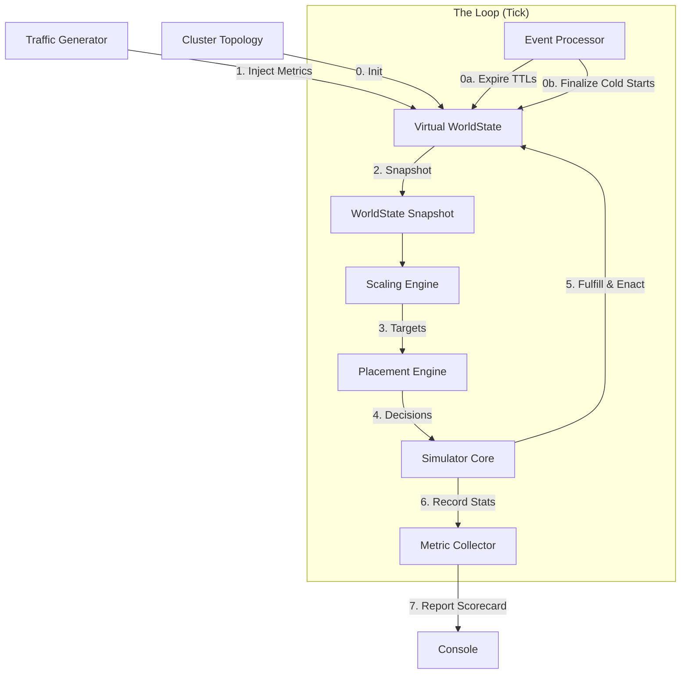

# Engineering Design: Schedulator Planning Simulator

## 1. Problem Statement

As Schedulator controls critical GPU resources and influences application SLAs, changes to its core algorithms (Scaling, Placement, Rebalancing) carry significant risk. We currently lack a principled way to:

1.  **Tune Magic Numbers:** The system relies on constants like `WEIGHT_FRAGMENTATION`, `QUEUE_HIGH_WATERMARK`, and `StabilizationCycles`. We do not know the optimal values for these.
2.  **Compare Algorithms:** We cannot empirically determine if a new placement strategy (e.g., "Dicer-style greedy with churn penalty") is better than the baseline without running it in production.
3.  **Capacity Planning:** We cannot easily answer "What happens to SLA violations if we lose a cluster?" or "How many H100s do we need for Q4 traffic?"
4.  **Regression Testing:** We need to ensure code changes do not degrade packing efficiency or stability.

We need an **Offline Simulation Framework** that can replay historical traffic or synthetic scenarios against the actual scheduling code to measure performance, stability, and efficiency.

## 2. Solution Overview

The **Planning Simulator** is a standalone tool (and potential CI test suite) that wraps the core Schedulator engines in a discrete time-step simulation. It mocks the external world (Kubernetes, vLLM, Hardware) and fast-forwards time to evaluate how the scheduler reacts to dynamic workloads.

### 2.1 Key Goals
*   **Fidelity:** Use the *actual* Go code for `ScalingEngine`, `PlacementEngine`, and `RebalancingEngine`.
*   **Speed:** Simulate 24 hours of traffic in seconds.
*   **Metrics:** Output comprehensive scorecards (SLA violations, GPU hours, migration counts).
*   **Reproducibility:** Deterministic runs for regression testing.

## 3. Architecture

The Simulator replaces the "Real World" (K8s, Network, Time) with a "Virtual World" while keeping the "Brain" (Schedulator Engines) intact.



### 3.1 Components

#### 1. Traffic Generator (Driver)
Responsible for simulating user load.
*   **Input:** Trace file (CSV) containing `(Timestamp, AppID, RPS, QueueDepth, KvUtil)`.
*   **Logic:** 
    *   **Open Loop:** Replays recorded metrics exactly.
    *   **Closed Loop:** Replays *RPS* but calculates *QueueDepth* dynamically:
        *   `NewRequests = RPS * TickInterval`
        *   `Processed = RunningReplicas * ThroughputPerReplica * TickInterval`
        *   `Queue = max(0, Queue + NewRequests - Processed)`

#### 2. Virtual WorldState
Utilizes the actual `internal/worldstate.WorldState` but driven by simulated time.
*   **Reservation Management:** Explicitly handles `CreateReservation`, `FulfillReservation`, and `ExpireStaleReservations` to prevent capacity leaks.
*   **Topology:** Initializes clusters and nodes with fixed GPU capacities.

#### 3. Simulator Core (Orchestrator)
Runs the main loop:
1.  **Process Events:** Checks the `eventQueue` for replicas finishing their `ColdStart`.
2.  **Expire Reservations:** Calls `ws.ExpireStaleReservations` using simulated time.
3.  **Update Metrics:** Requests `TrafficGenerator` to update `VLLMMetrics` in the world state.
4.  **Run Engines:** Calls the production `ScalingEngine` and `PlacementEngine`.
5.  **Enact Decisions:** 
    *   Scale-ups are created as `Pending`.
    *   Reservations are fulfilled immediately upon replica creation.
    *   `MarkRunning` events are queued for future ticks.

#### 4. Metric Collector (Scorecard)
Aggregates performance data and calculates a final weighted cost.

## 4. Design Details

### 4.1 Data Models

**Scenario Definition (YAML):**
```yaml
name: "Holiday Traffic Spike"
duration: "24h"
tick_interval: "1s"
closed_loop: true
topology:
  clusters:
    - id: "us-west-1"
      nodes: 100
      gpus_per_node: 8
apps:
  - id: "model-a"
    sla_ttft: 200ms
    cold_start: 60s
    throughput_per_replica: 5.0
    max_queue_depth: 100.0
workload: "traces/black_friday_2025.csv"
```

### 4.2 Handling Asynchrony
The simulator models the `ColdStart` delay using an internal `SimulationEvent` queue. 

1.  When a **Scale Up** decision is made:
    *   A `Replica` is created with `Status: Pending`.
    *   A `MarkRunning` event is pushed to the queue with `Time: Now + ColdStart`.
2.  On each **Tick**:
    *   The orchestrator pops events whose time has passed.
    *   Replica status is updated to `Running`.

### 4.3 Scoring Function
Cost is calculated as a weighted sum of violations and inefficiency:

$$
Cost = (W_{sla} \times \text{SLA\_Violations}) + (W_{util} \times (1 - \text{Avg\_Utilization})) + (W_{churn} \times \text{Scaling\_Ops})
$$

**Standard Weights:**
*   `WeightSLA = 1000.0`
*   `WeightUtilization = 100.0`
*   `WeightChurn = 10.0`

## 5. Resolved Implementation Issues

*   **Capacity Exhaustion:** Initially, "no capacity" warnings occurred because reservations were created but never fulfilled or expired. The simulator now explicitly calls `ws.FulfillReservation` when creating a pending replica and `ws.ExpireStaleReservations` at the start of every tick.
*   **Snapshot Performance:** Redundant snapshots in the event processor were optimized to use a single snapshot per tick interval.
*   **Node Selection:** Implemented a `findNodeWithCapacity` helper that iterates through the `WorldState` snapshot to ensure replicas land on nodes with actual free GPUs, rather than stubbing all placement to a single node.

## 6. Directory Structure

```
test/
  simulator/
    cmd/            # Main entrypoint (go run test/simulator/cmd/main.go)
    config/         # Scenario definitions (YAML) and config types
    traces/         # CSV workload files
    core/           # Simulator logic
      simulator.go  # Orchestrator & Event Loop
      traffic.go    # Open/Closed Loop Generator
      metrics.go    # Scorecard & CSV Logging
```
