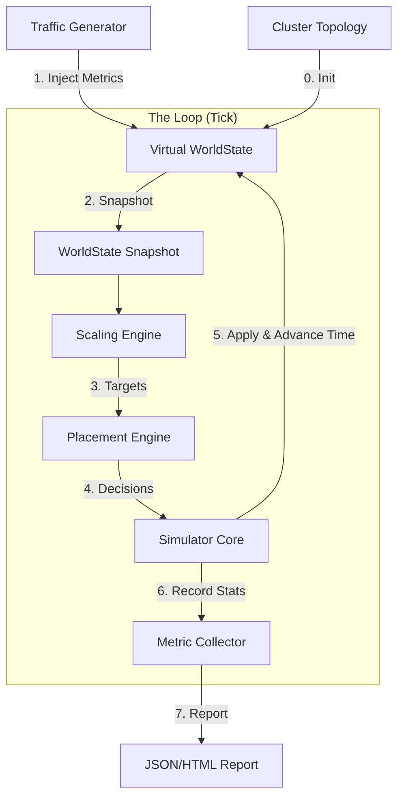

# Engineering Design: Schedulator Planning Simulator

## 1. Problem Statement

As Schedulator controls critical GPU resources and influences application SLAs, changes to its core algorithms (Scaling, Placement, Rebalancing) carry significant risk. We currently lack a principled way to:

1.  **Tune Magic Numbers:** The system relies on constants like `WEIGHT_FRAGMENTATION`, `QUEUE_HIGH_WATERMARK`, and `StabilizationCycles`. We do not know the optimal values for these.
2.  **Compare Algorithms:** We cannot empirically determine if a new placement strategy (e.g., "Dicer-style greedy with churn penalty") is better than the baseline without running it in production.
3.  **Capacity Planning:** We cannot easily answer "What happens to SLA violations if we lose a cluster?" or "How many H100s do we need for Q4 traffic?"
4.  **Regression Testing:** We need to ensure code changes do not degrade packing efficiency or stability.

We need an **Offline Simulation Framework** that can replay historical traffic or synthetic scenarios against the actual scheduling code to measure performance, stability, and efficiency.

## 2. Solution Overview

The **Planning Simulator** is a standalone tool (and potential CI test suite) that wraps the core Schedulator engines in a discrete time-step simulation. It mocks the external world (Kubernetes, vLLM, Hardware) and fast-forwards time to evaluate how the scheduler reacts to dynamic workloads.

### 2.1 Key Goals
*   **Fidelity:** Use the *actual* Go code for `ScalingEngine`, `PlacementEngine`, and `RebalancingEngine`.
*   **Speed:** Simulate 24 hours of traffic in seconds.
*   **Metrics:** Output comprehensive scorecards (SLA violations, GPU hours, migration counts).
*   **Reproducibility:** Deterministic runs for regression testing.

## 3. Architecture

The Simulator replaces the "Real World" (K8s, Network, Time) with a "Virtual World" while keeping the "Brain" (Schedulator Engines) intact.



### 3.1 Components

#### 1. Traffic Generator (Driver)
Responsible for simulating user load.
*   **Input:** Trace file (CSV/JSON) containing `(Timestamp, AppID, RequestRate)` or direct `vLLMMetrics` snapshots.
*   **Logic:** At each tick, updates the `VLLMMetrics` in WorldState.
    *   *Advanced:* Can model queue dynamics. If `Replicas` are low, it artificially increases `QueueDepth` in the metric update to simulate backlog.

#### 2. Virtual WorldState
A wrapper around the standard `internal/worldstate`.
*   **Time Travel:** Controls the "Current Time" (`TakenAt`).
*   **Event Queue:** Manages pending state changes (e.g., "At T+60s, marks Replica X as Running").
*   **Mock Clusters:** Simulates node capacity, failures, and latency.

#### 3. Simulator Core (Orchestrator)
Runs the main loop:
1.  **Advance Time:** Process event queue (e.g., finish startups, expire TTLs).
2.  **Update Load:** Ask Traffic Generator to update metrics.
3.  **Run Engines:** Call `Scaling.ComputeTargets` -> `Placement.ComputePlacement`.
4.  **Enact Decisions:**
    *   *Scale Up:* Create a "Pending" replica in WorldState. Queue event: "Set Status=Running" after `ColdStartSeconds`.
    *   *Scale Down:* Mark "Terminating". Queue event: "Remove Replica" after `TerminatingSeconds`.
    *   *Preempt:* Immediate kill (or short grace period).
5.  **Collect Metrics:** Record the state of the world for this tick.

#### 4. Metric Collector (Scorecard)
Aggregates performance data.

| Metric Category | Metrics |
| :--- | :--- |
| **SLA** | `% Ticks with Queue > Target`, `Total SLA Breach Duration` |
| **Efficiency** | `Avg GPU Utilization`, `Fragmented GPU Slots` |
| **Stability** | `Total Scale Ops`, `Total Migrations`, `Preemptions` |
| **Resources** | `Peak Allocated GPUs`, `Total GPU Hours` |

## 4. Design Details

### 4.1 Data Models

**Scenario Definition (YAML):**
```yaml
name: "Holiday Traffic Spike"
duration: "24h"
tick_interval: "10s"
topology:
  clusters:
    - id: "us-west-1"
      nodes: 100
      gpus_per_node: 8
apps:
  - id: "model-a"
    sla_ttft: 200ms
    cold_start: 60s
    profile: "profiles/llama2-70b.json"
workload: "traces/black_friday_2025.csv"
```

**Traffic Trace (CSV):**
```csv
timestamp,app_id,rps,queue_depth,kv_util
0,model-a,10,2,0.4
10,model-a,50,15,0.8  <-- Spike
...
```

### 4.2 Handling Asynchrony
The simulator must model the delay between "Decision" and "Effect".

*   **Scale Up Delay:**
    *   `PlacementEngine` creates a reservation and returns a decision.
    *   `Simulator` creates a `Replica` struct with status `Pending`.
    *   `Simulator` calculates `StartupTime`:
        *   If Node has cached weights (Tier 0): `5s`
        *   If Node has NVMe cache (Tier 1): `30s`
        *   If Cold (Tier 3): `300s`
    *   `Simulator` pushes event to PriorityQueue: `(CurrentTime + StartupTime, ACTION_MARK_RUNNING, ReplicaID)`.

*   **Traffic Feedback Loop (Advanced):**
    *   Simple mode: Replay recorded metrics exactly (Open Loop).
    *   Complex mode: Replay *Requests* (Closed Loop).
        *   `CurrentQueue = PreviousQueue + NewRequests - (RunningReplicas * ThroughputPerReplica)`.
        *   This allows the simulator to prove that scaling up *actually fixes* the queue.

### 4.3 Scoring Function
To compare algorithms A and B, we define a cost function:

$$
Cost = (W_{sla} 	imes 	ext{SLA\_Violations}) + (W_{util} 	imes (1 - 	ext{Utilization})) + (W_{churn} 	imes 	ext{Ops})
$$

Where:
*   $W_{sla} = 1000$ (High penalty for breaking promises)
*   $W_{util} = 100$ (Moderate value for saving money)
*   $W_{churn} = 10$ (Low penalty for noise)

## 5. Implementation Stages

### Phase 1: The Skeleton (MVP)
*   Implement `Simulator` struct.
*   Implement `MockWorldState` loading from a static topology file.
*   Implement "Open Loop" traffic (replay metrics directly).
*   Output: CSV of `(Time, TargetReplicas, RunningReplicas, AvailableGPUs)`.

### Phase 2: The Feedback Loop
*   Implement simple queue modeling: `Queue = Queue + Input - Output`.
*   This makes the simulation reactive. If the scheduler fails to scale, the queue grows infinitely.

### Phase 3: The Comparator
*   CLI tool to run multiple config variations in parallel.
*   Generate HTML report comparing A vs B side-by-side.

## 6. Directory Structure

```
test/
  simulator/
    cmd/            # Main entrypoint for CLI
    config/         # Scenario definitions
    traces/         # Sample workloads
    report/         # HTML generation
    core/           # Simulator logic
      simulator.go
      traffic.go
      metrics.go
```
